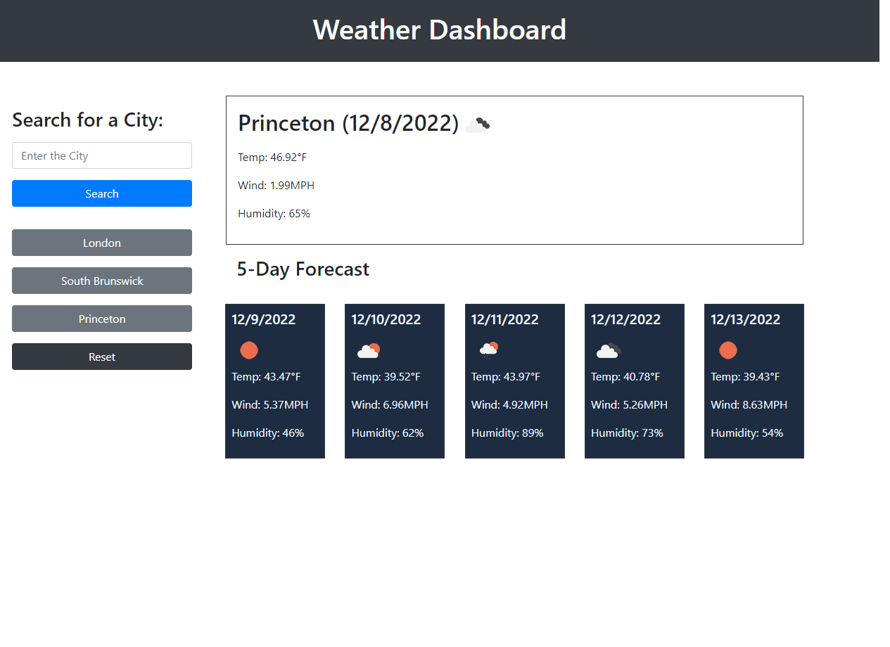

# Weather_Dashboard

## Description

```
A weather dashboard is for the traveler who wants to see the weather outlook for multiple cities so that he can plan a trip accordingly
Present with current and future condition for that city and that city is added to the search history
Present with the city name, the date, an icon representation of weather conditions, the temperture, the humidity, and the wind speed.
When click on a city in the search history, it presents with current and future conditions for that city.
User can reset the search history.

```

## Deployed Link

https://peterlim995.github.io/Weather_Dashboard/


## Screen Shot



